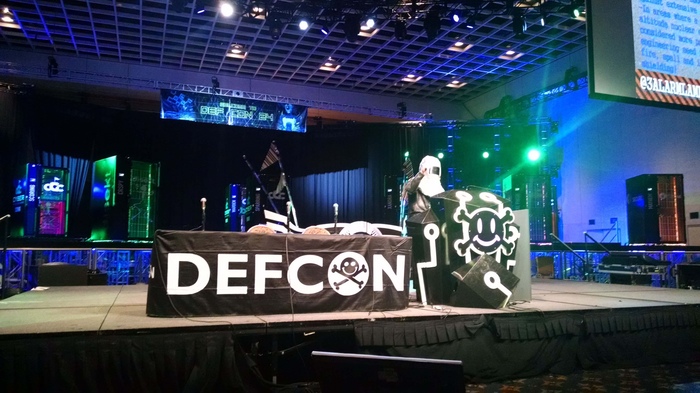

# DIY Nukeproofing: a new dig at "data-mining"

[Abstract](https://www.defcon.org/html/defcon-24/dc-24-speakers.html#3AlarmLampScooter)

## Summary
Speaker spoke in a welding / radiation hood, which made him almost uninteligible.  He got a late start due to projector issues, and spent his limited time talking about the history of nuclear warfare, the likelihood of proliferation, and the likelihood of various types of warfare.  I am sad that he didn't get around to much practical advice on providing shelter for your electronics from EMP.

## Notes
Tried to give this talk last year, but it got scuttled by the feds.  Ordering tritium from Thailand is bad, mkay?

### Background
He describes proliferation hazards, how much U235 and P239 you need to make a bomb, and littleboy vs. fat man, separation from U238 into a physics package, etc.

USSR ripped off Manhattan project.

Briefly described Teller-Ulan Fusion / Hydrogen product, and the "Great Nuclear Pissing Contest".

Describes Nuclear 'also-rans', non-prolifration treaty, SALT talks, START treaty, and graphs stockpile of the world over time.

Mutually Assured Destruction, Von Neumann vs. Herman Kahn vs Abdul Qadeer Khan.  The latter of whom proliferated centrifuges to Pakistan, North Korea, Iran, Iraq, Libya, and an unknown customer.

### Threat model: Global Thermonuclear War or a Pot Shot?
* 1.4MT Starfish Prime shot over Johnston atoll caused a devatating elctromagnetic pulse, resulting Van lallen belts destroyed a third of satellites in low earth orbit.
* Over half a centurly later, civilian infrastrucgture remains woefully unprotected from even the smallest EMPs.
* Nice graphic from the Nuclear Environment Survivability, US Army report AD-A278230 (1994)
* Urandim enrichment with lasers?  SILEX Systems gets classified
* Primary remaining defense is seizing uranium ore deposits until sea water extraction matures

small electronics stored offline in a trashcan, taped shut with copper or aluminum tape, to protect against ...
consider engineering need for overpressure, etc

... he ran out of time before really getting to the point of the talk.

I think I'm going to have to go read his primary sources from his slides to figure this out.
