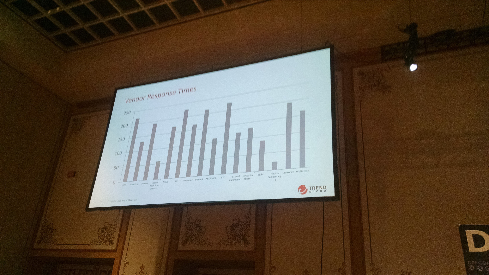

# Hacker-Machine Interface - State of the Union for SCADA HMI Vulnerabilities

[Abstract](https://www.defcon.org/html/defcon-24/dc-24-speakers.html#Gorenc)

## Notes
### Intro
Survey of 200+ 0day vulnerabilities in SCADA-HMI

Compare time-to-patch performance for vendors, and SCADA ind. vs other entitites in the software industry.

Fritz worked at Microsoft 25 years, in the Windows OS environment, then in Security for 13 days.  Moving to SCADA gave him e adeep appreciation of the code security practices at Microsoft (oh, Dear God, help us).

Focused on ICS equipment sales over software sales, not the HMI / software solution, windows applications.

Spends about 250k / year on buying 0days in the market.

* Vendors
* Siemens
* GE
* Advantech
* Wecon
* Cogen

### What's the HMI?
* Main hub for managing operating ocntrol systems
* collects data from the control systems
* presents visulization of the system arch
* alarms operator/sends notification
* should be operated on isolated and trusted networks... but usually isn't.

### Why target HMI?
* controls the targeted critical infrastructure
* harvest information about architecture
* Disable or deceive the alarm and notificatino systems
* Physically damage SCADA equipment

In Stuxnet, used HMI as a system to flip breakers and shut down the system.

Can attack to decieve and disable Alarm systems.  Used the HMI to deieve the operators that things were okay while they triggered destructive operations on the centrifuges themselves.

Stuxnet
   * First malware created to target ICS environment
   * Abused HMI vulns, with simple bugs

Black Energy
   * Ongoing sophisticated malware campaign compromising ICS environments
   * Abused HMI vulnerabilities
     a. used the GE CIMIPICITY Path Traversal Vuln which they purchased and disclosed

ICS-CERT
* Part of Homeland Security
* in 2015, responded to 295 incidents and handled 486 vuln disclosures

### Critical Infrastructure Attacks
#### Targeting Water Utilities
* Compromised intenret-facing AS/400 system
   a. network routing
   b. manipulation of Program. Logic Controllers (PLC)
   c. Management of PII and billing info
* Altered settings related to water flow and amount of chemicals that went into the water supply
* Four separate connections to the AS/400 over 60 days
* Actors IP tied to previous hacktivist activities

#### Targetting Power plans
* On Dec 24, 2015 Ukranian companies experience unscheduled power outages impacting 225k+ customers
   a. caused by external actors
   b. multiple coordinated attacks within 30 minutes of each other
* Used remote admin tools and/or remote industrial control system (ICS) client software to control breakers
* Used KillDisk to overwite Windows-based HMI system
   a. Disrupt restoration efforts, much longer MTTR

#### Targeting Railway and Mining Industry
* Mailware similar to the power incident found in the attacks against a Ukrainian rail and mining company
* Overlap between the samples found in Ukraininan power incident and those apparently used against the mining company

### Current state of HMI Solutions
* Not built with security in mind
* Seen no benefit of the evolution of the secure SDL
* Mitigatinos against advanced attacks are disabled
   * No ASLR, SafeSEH, Stack Cookies
* Poor design/developer assumptions
* Lack of understanding of real operating environment
   * Not on isolated or trusted networks
   * Continually being interconnected

### Case studies of common vulnerabilities
#### Injections
The usual (SQL injection, OS command injection, etc), but also domain-specific languages, eg. Cogent DataHub.
Cogent Datahub is the visulization framework, showing the plant's bits and pieces.
Gamma Script is it's scripting language, dynamicall-typed interpreted programming language.
Attack is a flaw in the EvalExpression method, allows for attacker controlled code.
Allows execution of arbitrary local commands.

#### Authentication / Authorization Problems
* Advantec bug, allows a logged in user to view any other users' passwords.  Web development fail 101.  The webserver returns the password without vaildating you're logged in as the right user in a secret field, eg. in plain text in the source.
* ActiveX DLL allows remote scripting

#### Credential Management
Quite often find hard coded credentials in the code.  In the case of GE MDS PulseNET, it has a hard coded support account which allows remote code execution.  UI shows only two users, inspecting the database shows a 3rd account with an MD5 hashed password, easily crack to see username: ge\_support, password: Pu1seNET

#### Memory Corruption
Received 100 buffer overflow bugs from an anonymous researcher in a single day, all stack and heap buffer overflows.
Implemented their own raw RPC binary protocol, used sprintf copy, with predictable results.
Probably first built 20 years ago, apparently never updated their build configuration, so no ASLR, no ASRH, no stack cookies.

##### Path Analysis
* sprintf is in the banned APIs list
* their patch switched to snprintf, which is also int he banned APIs list, because it doesn't null terminate
* they targeted just the reported problems, rather than systematically analyze and fix the codebase, thousands of other sprintf's.
* likely many vulnerabilities remain

### Recommendations
* Fuzz these things.
* Microsoft Attack Surface Analyzer (presenter helped write it)
* Audit for banned APIs, inspect with IDA

### Disclosure and MTTR
On average, 140 days from disclosure to patch.  Patching by humans take 2x to be fully applied, due to rollout issues, typically ~300 days to production.

Some are better than others:

Compared to other industries, SCADA vendors are roughly in the middle, not as good as "highly-deployed" eg. Microsoft et al (real software vendors), but much better than "Business" software, eg. HP.
